# Morse Code Signaling Device

This an enhancement of a program I wrote to drive a Texas Instruments developer board (the <a href="https://www.ti.com/product/CC3220S?utm_source=google&utm_medium=cpc&utm_campaign=epd-con-null-prodfolderdynamic-cpc-pf-google-wwe_int&utm_content=prodfolddynamic&ds_k=DYNAMIC+SEARCH+ADS&DCM=yes&gclid=CjwKCAjwyqWkBhBMEiwAp2yUFiHRiiUVbY2-NhIi8TBkDs9W6MIYJajMIaiPet_6u3Or9EIftjTzCBoCpBEQAvD_BwE&gclsrc=aw.ds">*TI CS3220S*</a>) to signal one of two Morse code messages on its LEDs and to switch between them (after completing the message in progress) at the press of a button. I created this as the third and final milestone of my *CS-350: Emerging Systems and Architectures* class.

As part of my *CS-499: Computer Science Capstone* class, I performed the following enhancements:

1. I simplified the functions employed to drive the LEDs from one function for each of the possible permutations (four functions in all, in the case of two LEDs) to one function total, taking a bit-field as function argument (with each bit corresponding to the state of a particular LED): this not only streamlined the existing code but would also make it much simpler to extend if a signaling mechanism with more than two elements were to be employed in the future;
2. I decomposed the signaling function into its most fundamental elements. In my initial submission, I had hardcoded each message as a switch statement examining every possible $500ms$ phase in the message's lifetime, an approach which was both tedious and error-prone. For the enhancement, only the individual Morse symbols (*i.e.*, the dot, the dash and the pause) were taken phase-by-phase: the message as a whole was iterated over character-by-character, each character in turn was transcribed into its Morse equivalent, and then that Morse code was iterated over with each symbol being signaled phase-by-phase;
3. I created a function containing a switch statement to transcribe characters into their Morse equivalent in order to facilitate the above enhancement. Not all characters have a Morse equivalent, so I made the decision to replace those characters that do not with a space;
4. I stored the available messages in an array, and separated the button functions to cycle forwards or backwards through that array; previously, both buttons performed the same function of switching from one message to the other. The user need only add or remove strings from the array to change the selection of messages available.

While my initial attempt ran correctly, the enhancements have made the code more reusable and extendable as it is now straightforward to add an arbitrary number of messages which will be signaled in the same way, and the list can be navigated either forwards or backwards depending upon which button is pressed. This shows an ability to look beyond the most basic requirements to create a better-organized and more flexible system which not only meets the initial specifications but provides a basis for further development of the code.

I developed it beyond the most obvious approach — at least, that which was most obvious to me — which achieve the most basic functionality required and instead abstracted the logic to the point where it can signal any message that is passed to it: all that would be required would be to add or remove strings from the array of messages, and those would then be available to signal as Morse code, too. The heart of the code — which takes a message charcter-by-character, converts each character to its Morse code equivalent and then iterates over that Morse code symbol-by-symbol (symbols being dots, dashes or the pauses between them), signaling each symbol by $500ms$ phases ($500ms$ being the greatest common denominator between all symbols and pauses) — is reproduced below in pseudocode:

###### Pseudoode for the signal_message() function:
```
FUNCTION signal_message():

INPUT string message;
INPUT int phase;

DEFINE character char;
DEFINE string morse;
DEFINE character symbol;

// take message one character at a time until the end
ASSIGN char ← next_character(message);
WHILE char IS NOT end_of_string:

  // transcribe character into Morse symbols 
  ASSIGN morse ← convert_to_morse(char);

  // take Morse code one symbol at a time
  ASSIGN symbol ← next_symbol(morse);
  WHILE symbol IS NOT end_of_string:

    // determine the nature of the current symbol
    IF symbol IS dot:

      // get next symbol if current one is complete
      IF phase > length(dot_signal):
        ASSIGN symbol <- get_next_symbol(char);
        ASSIGN phase ← 0;
      // and signal next phase of current symbol if not
      ELSE:
        CALL signal_dot(phase);
        INCREMENT phase;

    ELSE IF symbol IS dash:

      // get next symbol if current one is complete
      IF phase > length(dash_signal):
        ASSIGN symbol ← get_next_symbol(char);
        ASSIGN phase ← 0;
      // and signal next phase of current symbol if not
      ELSE:
        CALL signal_dash(phase);
        INCREMENT phase;

    // get next symbol if current one is complete
    IF phase > length(space_pause):
      ASSIGN symbol ← get_next_symbol(char);
      ASSIGN phase ← 0;
    // and signal next phase of current symbol if not
    ELSE:
      CALL signal_space(phase);
      INCREMENT phase;

  // get the next character if the preceeding is finished
  CALL signal_intra-character_pause();
  ASSIGN character ← next_character(message);
  ASSIGN phase ← 0;

// end of message reached
CALL signal_intra-message_pause();
ASSIGN phase ← 0;

// cycle message if button pressed
IF left_button_pressed:
  ASSIGN message ← get_previous_message()
IF right_button_pressed:
  ASSIGN message ← get_next_message()
```

The documentation for this project included — besides the pseudocode shown above — a flow-chart that would allow stakeholders to understand the workings of the program without having to understand the code itself:

###### Flowchart for the enhanced Morse Code Program:

